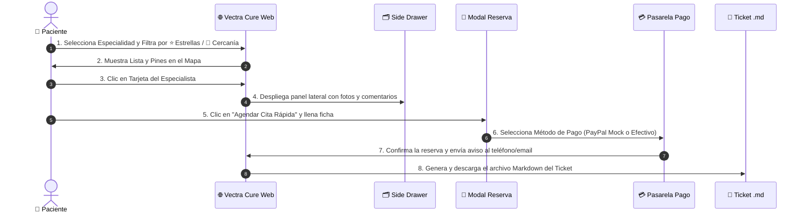

# 03. Flujo de Usuario, Agendamiento y Facturación

**Proyecto:** Vectra Cure — Plataforma de Geolocalización y Agendamiento Médico  
**Módulo:** Flujo de Reserva, Matriz Horaria, Cancelación con Reverso Simulado y Ticket Markdown

---

## 1. Flujo Completo del Paciente (Step-by-Step)



---

## 2. Modal de Agendamiento (Ficha del Paciente)

El proceso de reserva es ligero y consta de 2 fases:

### Fase 1: Datos de Contacto y Turno
* **Nombre y Apellido del Paciente**
* **Teléfono / WhatsApp:** (Para recepción de la confirmación)
* **Correo Electrónico:** (Para copia del ticket de reserva)
* **Selector de Fecha y Cuadrícula Horaria:** Bloques de atención disponibles de 2 horas (de 08:00 a 20:00).
* **Motivo breve de Consulta:** Campo de texto (ej. *"Dolor de muela desde anoche"* o *"Control de niño sano"*).

### Fase 2: Selección de Método de Pago
1. **Opción A — Pago Digital (PayPal Mock Simulado):**
   * Abre una ventana simulada de PayPal a nombre de *Vectra Cure Pay*.
   * Permite hacer clic en "Aprobar Pago Simulado" sin transferir dinero real.
   * Estado de la Cita: `PAGADO - TRANSACCIÓN SIMULADA`.

2. **Opción B — Pago en Efectivo (Ventanilla / Consultorio):**
   * No requiere datos de tarjeta.
   * Estado de la Cita: `PENDIENTE DE PAGO`.
   * Incluye la indicación obligatoria en el ticket:  
     > *"⚠️ Saldo pendiente: El pago en efectivo debe realizarse en la ventanilla de recepción del consultorio médico previo a su ingreso a la consulta."*

---

## 3. Experiencia de Cancelación y Reverso Simulado

Cuando un paciente cancela su turno desde la barra lateral de citas:

### 3.1. Pantalla 1: Modal de Confirmación y Motivos
El sistema solicita confirmar la acción y seleccionar una de las **5 razones de cancelación**:
1. `[ ]` 1. Problemas de horario o imprevisto personal.
2. `[ ]` 2. Encontré atención médica en otro lugar más rápido.
3. `[ ]` 3. Ya no presento molestias o síntomas médicos.
4. `[ ]` 4. Inconveniente con el costo o método de pago.
5. `[ ]` 5. **Otros** *(habilita un campo de texto opcional)*.

---

### 3.2. Pantalla 2: Animación de Procesamiento y Visto Verde Gigante
1. **Microanimación de Carga (~2 a 3 segundos):**
   * Indicador giratorio (*loading spinner*) con el mensaje: *"Procesando reverso y liberando cupo médico..."* para brindar una experiencia realista.
2. **Resultado de Éxito Visual:**
   * Despliegue de un **Visto gigante verde dentro de un círculo (✅)**.
   * Mensaje de confirmación: *"¡Cita cancelada con éxito! Se ha emitido la nota de reverso a tu cuenta."*
   * El turno queda inmediatamente disponible en el mapa para otros pacientes.

---

### 3.3. Protocolo Hospitalario de Inasistencia (No-Show)
* Si el paciente no asiste y no cancela previamente:
  * Se aplica una **tolerancia hospitalaria estricta de 15 minutos**.
  * Trascurrido ese tiempo, el sistema marca el turno como `NO_SHOW`, liberando la agenda del médico y guardando el registro histórico.

---

## 4. Estructura del Ticket de Reserva (`.md`)

Al finalizar el agendamiento, el usuario puede hacer clic en el botón **"Descargar Ticket de Cita (.md)"**, obteniendo un archivo ligero con formato de recibo de caja registradora térmica:

```text
============================================================
                     VECTRA CURE
         Plataforma de Citación Médica Digital
============================================================
TICKET DE RESERVA #VC-2026-8942
Fecha de Emisión: 2026-08-27 23:30
------------------------------------------------------------
DATOS DEL PACIENTE:
  Nombre: Camila Mendoza
  Teléfono: +593 99 123 4567
  Email: camila.mendoza@email.com

ESPECIALISTA Y CONSULTORIO:
  Doctor: Dr. Alejandro Morales (Verificado 🛡️ #MED-48291)
  Especialidad: Odontología (Endodoncia)
  Clínica: Centro Dental Santa Mónica
  Dirección: Av. República del Salvador 10-24 y Moscú
------------------------------------------------------------
DETALLE DE LA CITA:
  Fecha Cita: 2026-08-28
  Hora Cita:  14:00 - 16:00 (Tolerancia: 15 min)
  Motivo:     Evaluación por dolor agudo de muela
------------------------------------------------------------
DESGLOSE DE FACTURACIÓN:
  Consulta Odontológica (Aprox.): $ 35.00 USD
  Tasa de Plataforma:             $  0.00 USD
  -----------------------------------------
  TOTAL ESTIMADO:                 $ 35.00 USD

ESTADO DEL PAGO: 
  [X] PENDIENTE - PAGO EN EFECTIVO EN VENTANILLA
  (Favor acercarse a la recepción 10 min antes del turno)
============================================================
  Notificación de confirmación enviada a WhatsApp y Correo.
             ¡Gracias por confiar en Vectra Cure!
============================================================
```
