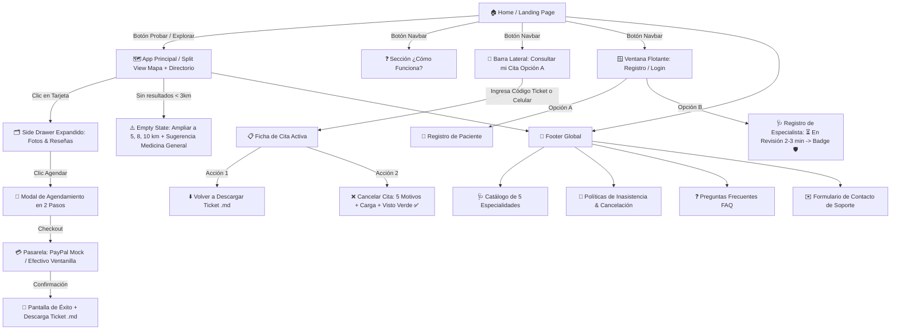
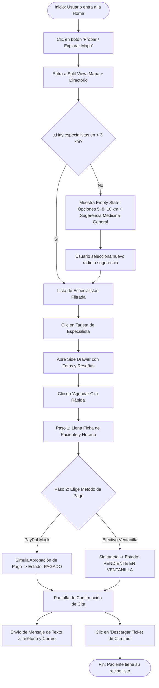
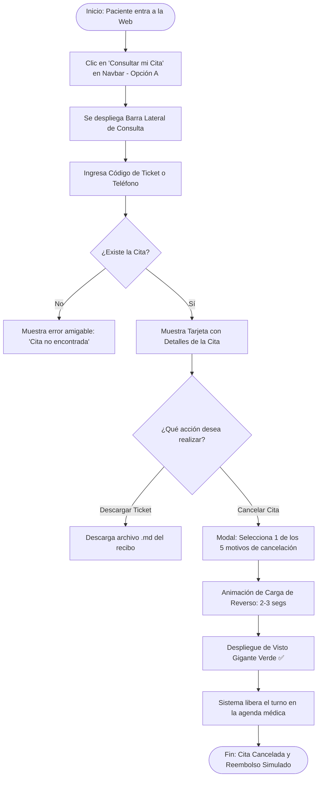
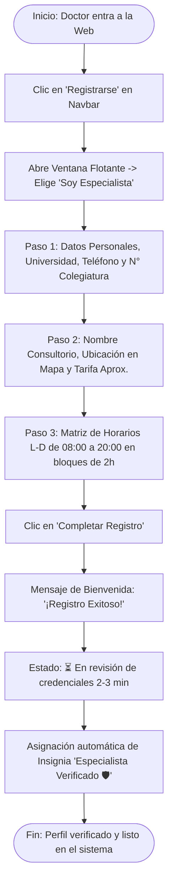

# 06. Mapa del Sitio y Flujos de Usuario (Sitemap & User Flows)

**Proyecto:** Vectra Cure — Plataforma de Geolocalización y Agendamiento Médico  
**Módulo:** Arquitectura de Navegación (Sitemap), Pantallas, Modales Flotantes y Diagramas de Flujo

---

## 1. Mapa del Sitio (Sitemap & Arquitectura de Pantallas)

---

## 2. Descripción de Pantallas y Componentes de Navegación

### 2.1. Pantalla 1: Home / Landing Page (Estilo Skiper UI / Recent Design)
* **Hero Section Dinámico:** Titular de alto impacto (*"Encuentra especialistas médicos verificados cerca de ti en segundos"*), microanimaciones fluidas y botón principal: `[ ⚡ Probar Plataforma / Explorar Mapa ]`.
* **Showcase de Características:** Tarjetas interactivas con las ventajas clave (Transparencia en precios, insignias de verificación 🛡️, geolocalización en tiempo real y agendamiento sin llamadas).
* **Catálogo de 5 Especialidades:** Selector visual con iconos (Medicina General, Odontología, Dermatología, Veterinaria, Pediatría).
* **Estadísticas de Confianza:** Indicadores de satisfacción, tiempos de agendamiento y validación social.

---

### 2.2. Pantalla 2: Aplicación Principal (Split View — Mapa + Directorio)
* **Barra Superior de Filtros:**
  * Buscador rápido por nombre o síntoma estilo Google Maps.
  * Chips interactivos: `[ ⭐ Mejor Calificados ]` *(primero)*, `[ 📍 Más Cercanos ]`, `[ 🕒 Abierto Ahora ]`, `[ 💵 Económico ]`.
* **Panel de Tarjetas (Izquierda):** Scroll vertical con la jerarquía oficial (Foto, 🛡️ Verificado, Nombre, ⭐ Estrellas arriba, 📍 Distancia abajo, Horarios y Precio aprox.).
* **Mapa Interactivo (Derecha):** Pines personalizados por especialidad con popup flotante al pasar el cursor.

---

### 2.3. Componente 3: Side Drawer Expandido (Detalle del Doctor)
* Se despliega hacia la derecha al hacer clic en una tarjeta.
* **Contenido:** Galería horizontal de fotos del consultorio (Google Maps Scrape), tarifas aproximadas por tratamiento y lista de comentarios de pacientes verificados.
* **Cierre fluido:** Se contrae hacia la izquierda al scrollear o hacer clic fuera.

---

### 2.4. Componente 4: Barra Lateral "Consultar mi Cita" (Opción A)
* Accesible desde el Navbar mediante un botón destacado.
* Se despliega una barra lateral limpia con un campo de búsqueda:
  * **Input:** Ingrese su *Código de Ticket (ej. `VC-8942`)* o *Número de Teléfono*.
* **Resultado:** Muestra la ficha de la cita agendada, el saldo pendiente o pagado, el botón para **volver a descargar el archivo `.md` del ticket** y el botón para **cancelar la cita** (con reverso simulado).

---

### 2.5. Componente 5: Ventana Flotante de Registro & Login
* Modal flotante centrado con efecto *glassmorphism*.
* **Conmutador (Switch):**
  * `[ 👤 Soy Paciente ]` -> Registro rápido con Nombre, Teléfono y Email.
  * `[ 🩺 Soy Especialista ]` -> Formulario en 2 pasos:
    1. **Verificación de Títulos:** Datos personales, Universidad, N° Colegiatura -> Animación de carga -> Mensaje de bienvenida *"¡Registro Exitoso!"* -> Estado: `⏳ En revisión de credenciales (2-3 min)` -> Activación automática de insignia `🛡️ Verificado`.
    2. **Consultorio y Horarios:** Ubicación en mapa, precio base y **Matriz dinámica de Horarios** (Lunes a Domingo, bloques de 2 horas de 08:00 a 20:00).

---

### 2.6. Componente 6: Pantalla de Búsqueda sin Resultados (Empty State)
* **Mensaje:** *"No hemos encontrado especialistas en tu zona inmediata. ¿Deseas ampliar tu radio de búsqueda?"*
* **Selectores de Radio Rápido:** `[ 📍 5 km ]` • `[ 📍 8 km ]` • `[ 📍 10 km ]`.
* **Sugerencia de Urgencia:** Recomendación destacada de especialistas en Medicina General cercanos disponibles hoy.

---

### 2.7. Componente 7: Footer Global
* **Servicios:** Enlaces directos para filtrar por las 5 especialidades.
* **Políticas:** Protocolo hospitalario de inasistencia (15 min tolerancia) y política de cancelación.
* **FAQ:** Acordeón con respuestas a dudas sobre reservas y pagos en ventanilla.
* **Contacto:** Formulario funcional de soporte técnico.

---

## 3. Flujos de Usuario Detallados (User Flows)

### 📌 User Flow 1: Búsqueda, Agendamiento y Facturación (Invitado / Paciente)

---

### 📌 User Flow 2: Consulta y Cancelación de Cita Agendada

---

### 📌 User Flow 3: Onboarding y Registro de Especialista Médico

