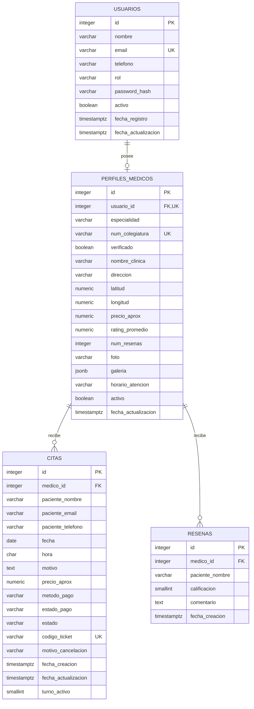

# Esquema y contexto de la base de datos

## 1. Propósito y alcance

Vectra Cure usa una base relacional para administrar cuentas, perfiles de
especialistas, citas y reseñas. PostgreSQL 18 es el motor de ejecución. Flask
accede a las tablas mediante Flask-SQLAlchemy y el controlador `psycopg`.

El esquema instalado se llama `public` y contiene cinco tablas:

- `usuarios`: identidad, autenticación y rol;
- `perfiles_medicos`: información profesional y ubicación del especialista;
- `disponibilidades_medicas`: intervalos estructurados de atención por especialista;
- `citas`: reserva, pago simulado, estado y ticket;
- `resenas`: calificación y comentario asociado a un especialista.

La primera versión del diseño aparece en `docs/architecture/04_TECHNICAL_ARCHITECTURE.md` con
nombres en inglés. La implementación adoptó nombres en español y añadió reglas
necesarias para autenticación, baja suave, cancelación y control de concurrencia.

## 2. Cómo se construye

La base se instala mediante scripts SQL manuales desde pgAdmin 4:

1. `00_create_database_postgresql.sql` crea `vectra_cure` con codificación
   UTF-8 y `template0`.
2. `01_schema_postgresql.sql` abre una transacción, crea las tablas en orden de
   dependencia, agrega restricciones e índices y confirma la transacción.
3. `02_seed_demo_postgresql.sql` verifica la base y el esquema, carga los datos
   de demostración y recalcula las métricas de reseñas.
4. `03_verificar_postgresql.sql` comprueba la instalación sin modificar datos.

El script de esquema no es idempotente: debe ejecutarse una sola vez en una
base vacía. La semilla sí puede repetirse; usa `ON CONFLICT` y búsquedas de
existencia para evitar duplicados demostrativos.

La aplicación no crea ni altera tablas al iniciar. `models.py` mapea el esquema
para las operaciones ORM. Las pruebas automatizadas construyen un esquema
equivalente en SQLite en memoria a partir de esos modelos.

## 3. Diagrama entidad-relación

`PK` indica clave primaria, `FK` clave foránea y `UK` unicidad.

## 4. Diccionario de datos

### 4.1 `usuarios`

Guarda las cuentas de pacientes, médicos y administradores. Pacientes y
administradores no necesitan un registro en `perfiles_medicos`.

| Columna | Tipo PostgreSQL | Nulo | Valor inicial o regla | Uso |
| --- | --- | --- | --- | --- |
| `id` | `INTEGER IDENTITY` | No | Clave primaria | Identificador interno. |
| `nombre` | `VARCHAR(120)` | No | — | Nombre visible de la cuenta. |
| `email` | `VARCHAR(100)` | No | Único | Identificador de acceso. |
| `telefono` | `VARCHAR(20)` | No | — | Contacto del usuario. |
| `rol` | `VARCHAR(20)` | No | `paciente` | Acepta `paciente`, `medico` o `admin`. |
| `password_hash` | `VARCHAR(255)` | Sí | — | Hash de Werkzeug; nunca almacena la contraseña en claro. |
| `activo` | `BOOLEAN` | No | `TRUE` | Implementa la baja suave. |
| `fecha_registro` | `TIMESTAMPTZ` | No | `CURRENT_TIMESTAMP` | Fecha de alta. |
| `fecha_actualizacion` | `TIMESTAMPTZ` | No | `CURRENT_TIMESTAMP` | Última actualización gestionada por el ORM. |

Restricción de dominio: `ck_usuarios_rol` limita los roles conocidos.

### 4.2 `perfiles_medicos`

Extiende una cuenta con datos profesionales, geográficos y comerciales. La
unicidad de `usuario_id` implementa una relación uno a uno.

| Columna | Tipo PostgreSQL | Nulo | Valor inicial o regla | Uso |
| --- | --- | --- | --- | --- |
| `id` | `INTEGER IDENTITY` | No | Clave primaria | Identificador del especialista. |
| `usuario_id` | `INTEGER` | No | FK única a `usuarios.id` | Cuenta propietaria del perfil. |
| `especialidad` | `VARCHAR(50)` | No | — | Área médica usada en filtros. |
| `num_colegiatura` | `VARCHAR(50)` | No | Único | Identificador profesional. |
| `verificado` | `BOOLEAN` | No | `FALSE` | Controla la insignia de verificación. |
| `nombre_clinica` | `VARCHAR(150)` | No | — | Nombre del consultorio o clínica. |
| `direccion` | `VARCHAR(255)` | No | — | Dirección mostrada al paciente. |
| `latitud` | `NUMERIC(10,8)` | No | Entre -90 y 90 | Coordenada para distancia. |
| `longitud` | `NUMERIC(11,8)` | No | Entre -180 y 180 | Coordenada para distancia. |
| `precio_aprox` | `NUMERIC(10,2)` | No | Mayor o igual a 0 | Precio copiado a la cita al reservar. |
| `rating_promedio` | `NUMERIC(3,2)` | No | `5.00`, entre 0 y 5 | Promedio desnormalizado de reseñas. |
| `num_resenas` | `INTEGER` | No | `0`, mayor o igual a 0 | Conteo desnormalizado de reseñas. |
| `foto` | `VARCHAR(255)` | Sí | — | Nombre o ruta de la foto principal. |
| `galeria` | `JSONB` | Sí | — | Lista JSON de imágenes del consultorio. |
| `horario_atencion` | `VARCHAR(100)` | No | `09:00 - 18:30` | Texto informativo del horario. |
| `activo` | `BOOLEAN` | No | `TRUE` | Oculta el perfil sin borrarlo. |
| `fecha_actualizacion` | `TIMESTAMPTZ` | No | `CURRENT_TIMESTAMP` | Última actualización gestionada por el ORM. |

Restricciones: `ck_perfiles_latitud`, `ck_perfiles_longitud`,
`ck_perfiles_precio`, `ck_perfiles_rating` y `ck_perfiles_num_resenas`.

### 4.3 `citas`

Guarda una reserva y una copia de los datos de contacto y precio usados al
confirmarla. Esta copia conserva el contexto histórico aunque cambien el perfil
del médico o la cuenta del paciente.

| Columna | Tipo PostgreSQL | Nulo | Valor inicial o regla | Uso |
| --- | --- | --- | --- | --- |
| `id` | `INTEGER IDENTITY` | No | Clave primaria | Identificador interno. |
| `medico_id` | `INTEGER` | No | FK a `perfiles_medicos.id` | Especialista reservado. |
| `paciente_nombre` | `VARCHAR(120)` | No | — | Nombre informado al reservar. |
| `paciente_email` | `VARCHAR(100)` | No | — | Correo informado al reservar. |
| `paciente_telefono` | `VARCHAR(20)` | No | — | Contacto y criterio de consulta. |
| `fecha` | `DATE` | No | — | Día de atención. |
| `hora` | `CHAR(5)` | No | Formato esperado `HH:MM` | Bloque horario. |
| `motivo` | `TEXT` | Sí | — | Motivo libre de la consulta. |
| `precio_aprox` | `NUMERIC(10,2)` | No | Mayor o igual a 0 | Precio histórico de la reserva. |
| `metodo_pago` | `VARCHAR(30)` | No | Dominio cerrado | `PAYPAL_MOCK` o `EFECTIVO_VENTANILLA`. |
| `estado_pago` | `VARCHAR(30)` | No | Dominio cerrado | Estado del pago simulado. |
| `estado` | `VARCHAR(20)` | No | `CONFIRMADA` | Estado operativo de la cita. |
| `codigo_ticket` | `VARCHAR(30)` | No | Único | Código público `VC-AAAA-NNNN`. |
| `motivo_cancelacion` | `VARCHAR(255)` | Sí | — | Justificación al cancelar. |
| `fecha_creacion` | `TIMESTAMPTZ` | No | `CURRENT_TIMESTAMP` | Momento de registro. |
| `fecha_actualizacion` | `TIMESTAMPTZ` | No | `CURRENT_TIMESTAMP` | Última actualización gestionada por el ORM. |
| `turno_activo` | `SMALLINT` calculado | Sí | `1` o `NULL` | Participa en la protección contra doble reserva. |

Dominios permitidos:

| Campo | Valores |
| --- | --- |
| `metodo_pago` | `PAYPAL_MOCK`, `EFECTIVO_VENTANILLA` |
| `estado_pago` | `PAGADO_SIMULADO`, `PENDIENTE_VENTANILLA`, `REEMBOLSADO_SIMULADO` |
| `estado` | `CONFIRMADA`, `COMPLETADA`, `CANCELADA`, `NO_SHOW` |

La columna calculada `turno_activo` vale `1` para citas `CONFIRMADA` o
`COMPLETADA`; vale `NULL` para citas `CANCELADA` o `NO_SHOW`. La restricción
única `uq_citas_turno_activo (medico_id, fecha, hora, turno_activo)` impide dos
citas activas en el mismo turno. PostgreSQL permite varias filas con `NULL`, por
lo que cancelar una cita libera el horario sin borrar su historial.

### 4.4 `resenas`

Guarda las opiniones recibidas por cada especialista.

| Columna | Tipo PostgreSQL | Nulo | Valor inicial o regla | Uso |
| --- | --- | --- | --- | --- |
| `id` | `INTEGER IDENTITY` | No | Clave primaria | Identificador interno. |
| `medico_id` | `INTEGER` | No | FK a `perfiles_medicos.id` | Especialista calificado. |
| `paciente_nombre` | `VARCHAR(100)` | No | — | Nombre público del autor. |
| `calificacion` | `SMALLINT` | No | Entre 1 y 5 | Valor usado para el promedio. |
| `comentario` | `TEXT` | Sí | — | Opinión opcional. |
| `fecha_creacion` | `TIMESTAMPTZ` | No | `CURRENT_TIMESTAMP` | Fecha de publicación. |

`rating_promedio` y `num_resenas` no se calculan en una vista ni mediante un
trigger. `logica.recalcular_rating()` los actualiza al crear, editar o borrar
una reseña desde Flask; la semilla ejecuta su propio cálculo agregado.

## 5. Relaciones y política de borrado

| Relación | Cardinalidad | Clave foránea | Al borrar el padre |
| --- | --- | --- | --- |
| Usuario → perfil médico | 1 a 0..1 | `perfiles_medicos.usuario_id` | `CASCADE`: intenta borrar el perfil. |
| Perfil médico → citas | 1 a 0..N | `citas.medico_id` | `RESTRICT`: conserva el historial y bloquea el borrado del perfil. |
| Perfil médico → reseñas | 1 a 0..N | `resenas.medico_id` | `CASCADE`: borra las reseñas dependientes. |

La aplicación usa baja suave para usuarios y perfiles (`activo = FALSE`). Esto
evita el conflicto entre el `CASCADE` de usuario a perfil y el `RESTRICT` de
perfil a citas.

Las reseñas conservan autor como texto demostrativo. Las citas sí tienen una FK
obligatoria hacia una cuenta paciente y conservan los datos de contacto como
instantánea histórica; la base puede así autorizar la gestión de la reserva.

## 6. Índices y patrones de consulta

PostgreSQL crea índices para las claves primarias y restricciones únicas. El
esquema añade índices explícitos para el directorio, disponibilidad y citas:

| Índice | Columnas | Consulta que favorece |
| --- | --- | --- |
| `ix_perfiles_especialidad_activo` | `especialidad, activo` | Directorio de especialistas activos por especialidad. |
| `ix_citas_telefono_fecha` | `paciente_telefono, fecha_creacion DESC` | Última cita consultada por teléfono. |
| `ix_citas_estado_fecha` | `estado, fecha` | Panel administrativo y agenda por estado/fecha. |
| `ix_resenas_medico_fecha` | `medico_id, fecha_creacion DESC` | Reseñas recientes de un especialista. |

La restricción `uq_citas_turno_activo` también sirve como índice cuyo prefijo
es `medico_id, fecha, hora`; apoya la comprobación de disponibilidad.

## 7. Datos demostrativos

La semilla carga el siguiente conjunto mínimo:

| Entidad | Cantidad esperada tras la primera carga |
| --- | ---: |
| Usuarios | 12: 1 administrador, 6 médicos y 5 pacientes |
| Perfiles médicos | 6 |
| Citas | 8 |
| Reseñas | 8 |

Los identificadores son `IDENTITY`; no se debe asumir un número concreto. La
semilla relaciona registros mediante correos y claves profesionales estables.

## 8. Conexión de la aplicación

`vectra_cure/config.py` resuelve la conexión en este orden:

1. usa `DATABASE_URL` si existe;
2. de lo contrario, compone la URL con `DB_USER`, `DB_PASSWORD`, `DB_HOST`,
   `DB_PORT` y `DB_NAME`;
3. usa `postgresql+psycopg` como dialecto predeterminado.

Las credenciales se guardan en `vectra_cure/.env`, nunca en esta carpeta ni en
el control de versiones. SQLite se reserva para `TestConfig` y las pruebas.

## 9. Evolución del esquema

El repositorio todavía no usa Alembic ni una tabla de control de migraciones.
Por ello, `01_schema_postgresql.sql` describe una instalación nueva, pero no
debe volver a ejecutarse sobre una base poblada.

Para un cambio futuro:

1. conserva `01_schema_postgresql.sql` como esquema completo para instalaciones
   nuevas;
2. crea un script versionado y reversible, por ejemplo
   `migrations/20260830_01_descripcion.sql`, para bases existentes;
3. realiza primero cambios compatibles, rellena datos y agrega restricciones al
   final;
4. actualiza `models.py`, este documento y el script de verificación;
5. prueba la migración y su reversión sobre una copia de datos.

## 10. Verificación mínima

Después de instalar o migrar:

1. ejecuta `03_verificar_postgresql.sql` en una conexión nueva a `vectra_cure`;
2. confirma cinco tablas, las restricciones esperadas y los índices V2;
3. inicia Flask con una conexión nueva para validar las credenciales reales;
4. ejecuta `python -m unittest discover -s tests -v` desde `vectra_cure`;
5. prueba crear y cancelar una cita en el mismo turno para confirmar que la
   cancelación libera el cupo.
## Addendum V2 — disponibilidad y propiedad de las citas

Desde la V2 el esquema contiene cinco tablas. `disponibilidades_medicas` es la
fuente de verdad para los intervalos de atención de cada especialista: un día
de semana de `0` (lunes) a `6` (domingo), hora de inicio, hora de fin y estado
activo. `perfiles_medicos.horario_atencion` se conserva como texto heredado
para compatibilidad visual, pero no autoriza por sí solo una reserva.

`citas.paciente_usuario_id` es obligatorio y referencia `usuarios.id` con
`ON DELETE RESTRICT`. Los tres campos de paciente siguen siendo una instantánea
histórica; la FK permite que “Mis citas”, el ticket y la cancelación solo sean
accesibles por la cuenta que hizo la reserva. La migración no destructiva para
bases existentes está en `04_migracion_v2_postgresql.sql`; una instalación
nueva usa directamente `01_schema_postgresql.sql` seguido de la semilla.
