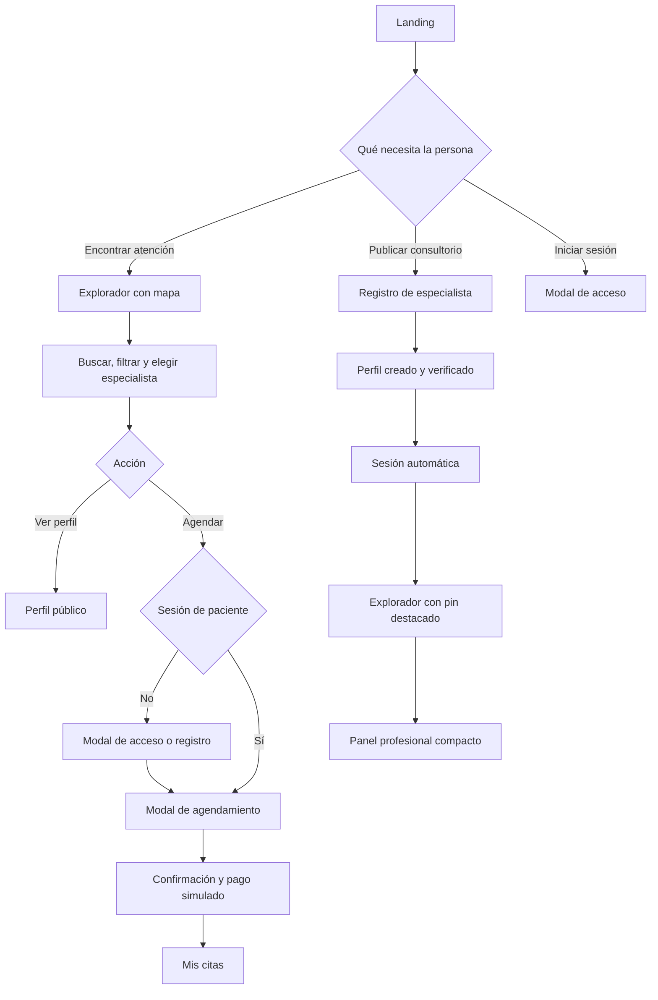

# Flujos de producto V2 — Vectra Cure

**Estado:** definición funcional. Este documento no autoriza programación.
**Alcance:** describe los recorridos de pacientes, especialistas y visitantes para el rediseño V2. Complementa y, cuando haya conflicto, prevalece sobre los flujos anteriores de acceso, directorio y reserva.

## 1. Principios de navegación

Vectra Cure separa tres momentos:

1. **Landing:** explica el producto y dirige a la persona.
2. **Explorador:** permite descubrir especialistas en un mapa y comparar opciones.
3. **Reserva y gestión:** permite elegir una franja válida, confirmar una cita y administrarla desde una cuenta autenticada.

La persona puede explorar antes de iniciar sesión. Debe iniciar sesión o registrarse antes de confirmar una reserva, consultar una cita privada o acceder al resumen profesional.

## 2. Mapa general de recorridos

## 3. Flujo: visitante en la landing

### Objetivo

Entender Vectra Cure y escoger su recorrido sin enfrentarse a resultados médicos demasiado pronto.

### Pasos

1. El visitante abre la landing.
2. Ve el hero con dos acciones de la misma jerarquía:
   - **Explorar especialistas**
   - **Publicar mi consultorio**
3. Puede recorrer la narrativa: especialistas recomendados, cómo funciona, especialidades y señales de confianza.
4. Si pulsa una especialidad, Vectra Cure abre el explorador con ese filtro aplicado.
5. Si pulsa **Iniciar sesión**, se abre el modal de acceso.
6. Si ya tiene sesión iniciada, la navegación muestra accesos apropiados a su rol.

### Resultado

La landing no presenta un mapa funcional ni una lista larga de médicos. Solo orienta y conduce al explorador o al registro profesional.

## 4. Flujo: explorar especialistas y mapa

### Objetivo

Encontrar profesionales por necesidad, ubicación y radio sin perder el contexto geográfico.

### Pasos

1. La persona abre el explorador desde la landing, una especialidad o un enlace directo.
2. El sistema muestra:
   - mapa abierto con atribución visible;
   - panel lateral de búsqueda, filtros y resultados;
   - referencia de ubicación actual o Quito como alternativa;
   - radio inicial de 3 km.
3. La persona puede autorizar su ubicación.
   - Si acepta, el sistema recalcula cercanía desde su posición.
   - Si rechaza, el sistema conserva Quito como referencia y explica cómo cambiar la zona.
4. La persona busca por texto o selecciona una especialidad.
5. Puede ordenar por cercanía, calificación o precio aproximado.
6. Puede ampliar el radio a 5, 8 o 10 km.
7. El sistema actualiza mapa, contador y resultados conservando los filtros activos.
8. Al elegir un marcador o una tarjeta, la tarjeta correspondiente se expande dentro del panel lateral.
9. Desde la tarjeta expandida puede:
   - ver perfil;
   - ver ruta;
   - agendar una cita.

### Reglas

- El panel lateral es el único contenedor de filtros y resultados. No existe un segundo drawer de detalle.
- Solo una tarjeta puede quedar expandida.
- La ruta se solicita solo tras una acción explícita. Si no está disponible, se muestra la distancia Haversine.
- El mapa sigue siendo útil aunque falle el servicio de rutas.

### Estado sin resultados

1. El sistema indica especialidad, radio y zona de referencia.
2. Propone ampliar el radio al siguiente valor.
3. Permite cambiar especialidad, zona o limpiar filtros.
4. No rellena la pantalla con profesionales irrelevantes.

## 5. Flujo: tarjeta y perfil público de especialista

### Tarjeta compacta

La tarjeta muestra foto, nombre, especialidad, verificación demostrativa, calificación, distancia y una señal breve de disponibilidad. No muestra botones de reserva.

### Tarjeta expandida

Al seleccionarla, revela:

- área de atención;
- ubicación;
- días y franjas de atención;
- precio aproximado;
- próxima disponibilidad;
- acciones **Ver perfil**, **Ver ruta** y **Agendar cita**.

### Perfil público

1. La persona pulsa **Ver perfil**.
2. Abre una página independiente con información completa del especialista, consultorio, disponibilidad, reseñas demostrativas y precio.
3. Desde esa página puede volver al mapa, solicitar ruta o iniciar el agendamiento.
4. El perfil público no expone datos privados ni el panel profesional.

## 6. Flujo: autenticación y registro de paciente

### Inicio de sesión

1. El visitante pulsa **Iniciar sesión** desde navegación, reserva o una acción protegida.
2. Se abre un modal con fondo suavemente desenfocado.
3. El modal contiene foco, se cierra con Escape y mantiene una ruta de acceso completa como respaldo.
4. Tras autenticarse:
   - paciente → explorador o acción pendiente;
   - especialista → explorador con acceso a su panel compacto;
   - administrador → su espacio administrativo existente.

### Registro de paciente

1. El visitante elige **Crear cuenta como paciente** dentro del modal.
2. Completa un registro breve.
3. El sistema crea la cuenta e inicia sesión automáticamente.
4. Si había una reserva pendiente, vuelve al modal de reserva con el especialista y la fecha elegidos.
5. Si no había acción pendiente, abre el explorador.

### Reglas

- El registro de paciente no abre una página independiente durante este flujo.
- La sesión es necesaria para crear una cita y acceder a información privada de una cita.
- Los errores de formulario aparecen junto al campo y conservan los datos ya escritos.

## 7. Flujo: registro de especialista y visibilidad

### Objetivo

Crear un perfil público completo y permitir que el nuevo especialista vea dónde aparecerá.

### Pasos

1. La persona pulsa **Publicar mi consultorio**.
2. Abre una página completa de registro profesional.
3. Completa cuatro grupos:
   - identidad y credenciales;
   - especialidad, precio y descripción;
   - datos del consultorio y ubicación;
   - disponibilidad por día y franja horaria.
4. Revisa un resumen y envía el formulario.
5. El sistema crea usuario, perfil y disponibilidad.
6. En esta demostración, el perfil queda verificado y visible de inmediato.
7. El sistema inicia sesión automáticamente.
8. Redirige al explorador con el pin del nuevo perfil destacado.
9. El especialista puede abrir su panel compacto.

### Reglas

- No se muestra un mensaje de “credenciales en revisión”.
- El sistema no promete una revisión documental real.
- Si falla el registro, mantiene los datos válidos y señala el grupo que requiere corrección.

## 8. Flujo: panel profesional compacto

### Objetivo

Dar al especialista una vista útil sin construir un dashboard fuera de alcance.

### Pasos

1. El especialista autenticado abre el panel desde la navegación del explorador.
2. El panel muestra tres bloques:
   - hasta tres próximas citas;
   - balance estimado de consultas confirmadas y pendientes;
   - visibilidad del perfil: verificación demostrativa, calificación y enlace público.
3. Si no hay citas, explica que el perfil está activo y listo para recibir reservas.
4. El panel solo consulta datos del especialista de la sesión.

### Límites

No incluye pagos reales, administración de múltiples consultorios, mensajería ni reportes complejos.

## 9. Flujo: agendamiento

### Precondiciones

- El paciente ya eligió un especialista.
- La tarjeta o el perfil muestran disponibilidad.
- El paciente tiene sesión iniciada. Si no la tiene, primero completa el flujo de acceso.

### Pasos

1. El paciente pulsa **Agendar cita**.
2. Se abre el modal de agendamiento con resumen del especialista.
3. Elige una fecha desde el día actual.
4. El sistema muestra solo las horas disponibles para ese especialista y esa fecha.
5. El paciente selecciona una hora.
6. Revisa fecha, hora, ubicación, precio aproximado y método de pago simulado.
7. Confirma la reserva.
8. El sistema valida nuevamente, en servidor:
   - fecha no pasada;
   - disponibilidad del especialista;
   - ausencia de una cita activa en la misma franja;
   - identidad del paciente autenticado.
9. Se crea la cita y su ticket.
10. El sistema muestra confirmación y dirige a **Mis citas**.

### Estados

- Día sin horas disponibles: propone fechas cercanas.
- Fecha pasada: no permite seleccionarla.
- Franja tomada durante la confirmación: informa y solicita otra hora.
- Error de conexión: conserva selección mientras sea posible.
- Confirmación correcta: muestra ticket y acciones para ver cita o explorar más especialistas.

## 10. Flujo: pago simulado y comprobante

1. Tras seleccionar fecha y hora, el paciente elige una modalidad de pago disponible en la demostración.
2. El sistema muestra una confirmación coherente con el método:
   - pago simulado aprobado;
   - pago pendiente en ventanilla, si aplica.
3. La cita conserva su estado de pago.
4. El ticket contiene código, especialista, fecha, hora, importe orientativo y estado.
5. El ticket es un comprobante; no permite a terceros consultar la cita sin sesión.

## 11. Flujo: mis citas y consulta de cita

### Paciente autenticado

1. El paciente abre **Mis citas** desde la navegación.
2. Ve primero su próxima cita y, después, su historial.
3. Cada cita muestra fecha, hora, especialista, ubicación, precio aproximado, estado de pago y ticket.
4. Puede abrir el perfil, ver ruta, descargar comprobante o cancelar si la política lo permite.

### Estado vacío

Si el paciente no tiene citas, la pantalla explica el estado y ofrece volver al explorador.

### Autorización

El sistema comprueba que la cita pertenezca al usuario autenticado antes de mostrarla, descargar su comprobante, cancelarla o procesar un reverso.

## 12. Flujo: cancelación y reverso

### Cancelación

1. El paciente abre una cita propia.
2. Pulsa **Cancelar cita**.
3. Un modal resume especialista, fecha, hora y monto.
4. Elige uno de cinco motivos:
   - cambio de horario;
   - encontré otra opción;
   - problema personal;
   - error al reservar;
   - otro motivo.
5. Puede añadir un comentario opcional.
6. Revisa la política y confirma o conserva su cita.
7. El sistema actualiza el estado de la cita y registra el motivo.

### Reverso simulado

1. Si corresponde, el sistema crea o actualiza el estado de reverso.
2. Muestra uno de estos estados:
   - no aplica;
   - pendiente;
   - completado.
3. La vista muestra monto y fecha cuando existan.
4. No se simula una transferencia bancaria real ni se promete un plazo real de devolución.

## 13. Matriz de estados críticos

| Situación | Respuesta de interfaz | Regla de sistema |
| --- | --- | --- |
| Ubicación rechazada | Quito como referencia y acción para cambiar zona | La búsqueda sigue disponible. |
| Mapa no disponible | Resultado y filtros siguen visibles | No se bloquea el directorio. |
| Ruta no disponible | Distancia aproximada y explicación breve | No se intenta recalcular repetidamente. |
| Sin resultados | Ampliar radio, cambiar zona o limpiar | No se muestran resultados ajenos al filtro. |
| Fecha pasada | Día bloqueado y mensaje claro | El servidor rechaza la reserva. |
| Horario ocupado | Solicitud de otra franja | Se protege la cita activa en la base. |
| Sin sesión al reservar | Modal de acceso | Se conserva la intención de reserva. |
| Cita ajena | Mensaje de acceso no autorizado | No se expone información de la cita. |
| Sin citas | Estado vacío con CTA al explorador | No se muestra historial ficticio. |
| Sin próximas citas para especialista | Estado de perfil activo | No se inventan ingresos ni citas. |

## 14. Rutas y responsabilidades

| Ruta o pantalla | Acceso | Acción principal |
| --- | --- | --- |
| Landing | Público | Elegir explorar o publicar consultorio |
| Explorador | Público | Buscar y elegir especialista |
| Perfil público | Público | Comparar y solicitar reserva |
| Modal de acceso | Público | Iniciar sesión o registrar paciente |
| Registro de especialista | Público | Crear perfil profesional |
| Modal de agendamiento | Paciente autenticado | Seleccionar fecha y hora |
| Mis citas | Paciente autenticado | Consultar, descargar o cancelar |
| Panel profesional | Especialista autenticado | Ver actividad propia |
| Administración | Administrador autenticado | Gestión existente del sistema |

## 15. Criterios de aceptación de flujos

- [ ] Una persona puede recorrer la landing sin ver el directorio completo.
- [ ] Una especialidad de la landing abre el explorador con su filtro activo.
- [ ] El explorador funciona con o sin permiso de ubicación.
- [ ] Una tarjeta se expande antes de revelar acciones de perfil o reserva.
- [ ] El registro de paciente inicia sesión y conserva una reserva pendiente.
- [ ] El registro de especialista crea perfil, disponibilidad y sesión antes de destacar su pin.
- [ ] El agendamiento rechaza fechas pasadas y franjas no disponibles en cliente y servidor.
- [ ] Un paciente solo consulta y cancela sus propias citas.
- [ ] Un especialista solo ve su propio panel de actividad.
- [ ] Cada flujo tiene estados de carga, error, vacío y éxito cuando corresponde.
- [ ] Las alternativas móviles no dependen de hover.
- [ ] Las animaciones respetan movimiento reducido.

## 16. Referencias

- `docs/prds/landing-medica-v2-v1.0-prd.md`
- `docs/prds/plan-maestro-producto-vectra-cure-v1.0.md`
- `docs/product/03_USER_FLOW_AND_BOOKING.md`
- `docs/product/06_SITEMAP_AND_USER_FLOWS.md`
- `FLUJO_DE_TRABAJO.md`

---

**Versión:** 1.0
**Cobertura:** landing, exploración, filtros, fichas, acceso, registro, reserva, pago simulado, consulta, cancelación, reverso y actividad profesional.
